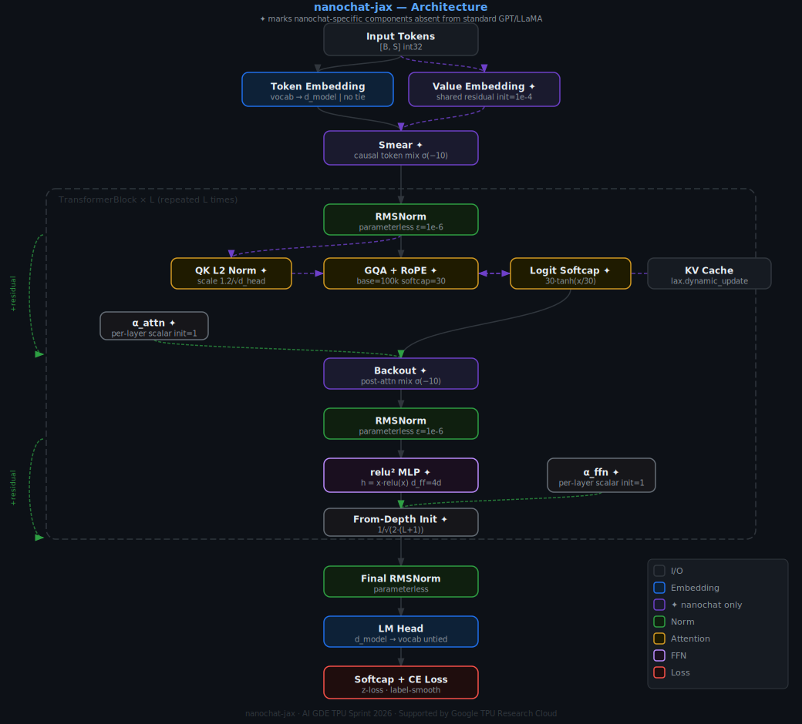

<div align="center">

# nanochat-jax

**A faithful JAX/Flax NNX port of the nanochat architecture with empirical scaling law experiments.**

[](https://www.python.org/)
[](https://github.com/google/jax)
[](https://github.com/google/flax)
[](LICENSE)
[](#testing)

<br/>

🇺🇸 English &nbsp;|&nbsp; [🇨🇳 中文](docs/i18n/README_zh.md) &nbsp;|&nbsp; [🇯🇵 日本語](docs/i18n/README_ja.md) &nbsp;|&nbsp; [🇰🇷 한국어](docs/i18n/README_ko.md) &nbsp;|&nbsp; [🇫🇷 Français](docs/i18n/README_fr.md) &nbsp;|&nbsp; [🇩🇪 Deutsch](docs/i18n/README_de.md)

<br/>

> **AI GDE TPU Sprint 2026** — Thanks to Google for providing TPU Research Cloud credits that power this project.

</div>

---

## What this is

`nanochat-jax` has two jobs:

1. **Port** — Reproduce every architectural detail of [nanochat](https://github.com/karpathy/nanochat) in JAX + Flax NNX: parameterless RMSNorm, relu² MLP, QK L2-norm, logit softcap, value embeddings, per-layer scalars, Smear/Backout token mixing, Muon optimizer with cubic Newton-Schulz, and BOS-aligned packing.

2. **Scale** — Instrument that model to run Chinchilla-style `scale_n / scale_d / scale_c` experiments, fit power laws, and produce results like:

```
L = 3.29 × N^(−0.027)   [TinyShakespeare, char-level, 600 steps]
```

If you want to understand how nanochat works internally, or run your own scaling experiments in JAX, this is the repo.

---

## Architecture



> **[Interactive D3.js diagram →](docs/architecture.html)** — open in a browser, hover each block for implementation details.

```
Input [B, S]
    │
    ├─────────────────────────────────┐
    ▼                                 ▼
Token Embedding                 Value Embedding ✦
  vocab → d_model                 shared residual, init=1e-4
    │                                 │
    └──────────────┬──────────────────┘
                   ▼
               Smear ✦
        causal token mix, σ(−10) init
                   │
 ┌─────────────────────────────────────────────┐
 │  TransformerBlock  × L                      │
 │                                             │
 │  ┌────────────────────────────────────┐     │
 │  │  Parameterless RMSNorm             │     │
 │  │  y = x / √(mean(x²) + ε)  no γ/β  │     │
 │  └───────────────┬────────────────────┘     │
 │                  │                          │
 │  ┌───────────────▼────────────────────┐     │
 │  │  QK L2 Norm ✦  →  GQA + RoPE ✦    │     │
 │  │  scale = 1.2/√d_head               │     │
 │  │  base = 100,000                    │     │
 │  │  logit softcap  30·tanh(x/30) ✦    │     │
 │  │  sliding window attention (opt.)   │     │
 │  └───────────────┬────────────────────┘     │
 │                  │  × α_attn ✦              │
 │                  ▼          ╲               │
 │         Backout ✦    ←────── + residual     │
 │      post-attn token mix                    │
 │                  │                          │
 │  ┌───────────────▼────────────────────┐     │
 │  │  Parameterless RMSNorm             │     │
 │  └───────────────┬────────────────────┘     │
 │                  │                          │
 │  ┌───────────────▼────────────────────┐     │
 │  │  relu² MLP ✦                       │     │
 │  │  h = x · relu(x)                   │     │
 │  │  d_ff = 4 × d_model,  no bias      │     │
 │  └───────────────┬────────────────────┘     │
 │                  │  × α_ffn ✦               │
 │                  │  from-depth init ✦        │
 │                  ▼          ╲               │
 │                             + residual      │
 └─────────────────────────────────────────────┘
                   │
             Final RMSNorm
                   │
          LM Head  (untied weights ✦)
                   │
     CE Loss  +  optional z-loss
```

**✦ = nanochat-specific features** absent from standard GPT/LLaMA.

### Model presets

| Preset | d\_model | Layers | Q Heads | KV Heads | seq\_len | Params |
|--------|--------:|-------:|--------:|---------:|---------:|-------:|
| `nano` | 128 | 4 | 4 | 4 | 64 | ~886K |
| `small` | 512 | 6 | 8 | 8 | 2048 | ~50M |
| `medium` | 1024 | 12 | 16 | 8 GQA | 2048 | ~210M |
| `large` | 2048 | 24 | 32 | 8 GQA | 4096 | ~1.5B |
| `xlarge` | 4096 | 32 | 32 | 8 GQA | 4096 | ~7B |

---

## Install

```bash
git clone https://github.com/ainaomotayo/nanochat-jax
cd nanochat-jax
pip install -e ".[dev]"
```

**GPU (CUDA 12):**
```bash
pip install -U "jax[cuda12]"
```

**TPU (Google Cloud / Colab TPU):**
```bash
pip install -U "jax[tpu]" \
  -f https://storage.googleapis.com/jax-releases/libtpu_releases.html
```

Verify the device:
```python
import jax
print(jax.devices())   # GPU, TPU, or CPU
```

---

## Quick start

**Synthetic smoke test (no data needed, ~30 s):**
```bash
python scripts/train.py --model-size nano --use-synthetic --total-steps 50
```

**TinyShakespeare (char-level, ~90 s on RTX 3050):**
```bash
# Download 1 MB of Shakespeare
curl -o data/tinyshakespeare.txt \
  https://raw.githubusercontent.com/karpathy/char-rnn/master/data/tinyshakespeare/input.txt

# Tokenise → HDF5  (char-level, vocab = 68 tokens)
python scripts/preprocess_shakespeare.py

# Train nano model
python scripts/train.py \
  --model-size nano \
  --data-path data/shakespeare_char.h5 \
  --total-steps 2000 \
  --learning-rate 3e-3
```

---

## Training

### Python API

```python
from nanochat.config import ModelConfig, TrainingConfig
from nanochat.model.transformer import TransformerLM
from nanochat.training.trainer import Trainer
from nanochat.data.dataset import TokenDataset
from nanochat.data.loader import build_dataloader
from flax import nnx

model_cfg = ModelConfig.for_scale("nano")
train_cfg = TrainingConfig(
    batch_size    = 32,
    optimizer     = "muon",      # nanochat default
    learning_rate = 3e-4,
    total_steps   = 5_000,
    warmup_steps  = 200,
    dtype         = "bfloat16",
)

model   = TransformerLM(model_cfg, rngs=nnx.Rngs(params=0, dropout=1))
dataset = TokenDataset("data/shakespeare_char.h5", seq_len=model_cfg.max_seq_len)
loader  = build_dataloader(dataset, train_cfg.batch_size, shuffle=True)

trainer = Trainer(model, loader, None, model_cfg, train_cfg)
results = trainer.train()
```

### CLI

```
python scripts/train.py
  --model-size   {nano,small,medium,large,xlarge}
  --data-path    PATH_TO_HDF5
  --total-steps  N
  --batch-size   N
  --learning-rate LR
  --dtype        {float32,bfloat16}
  --checkpoint-dir DIR
  --eval-every   N
  --save-every   N
  --seed         N
```

### Optimizer — Muon

Muon applies Newton-Schulz orthogonalisation to the gradient before the momentum update, on 2-D weight matrices. Embeddings and biases fall back to SGD with momentum.

```python
TrainingConfig(
    optimizer         = "muon",
    muon_momentum     = 0.95,
    muon_nesterov     = True,
    muon_ns_steps     = 10,      # all 10 cubic NS steps fused in one XLA op
    muon_weight_decay = 0.01,
)
```

Switch to AdamW for baselines:
```python
TrainingConfig(optimizer="adamw", weight_decay=0.1, beta1=0.9, beta2=0.95)
```

### Resume from checkpoint

```python
from nanochat.training.checkpoint import CheckpointManager

ckpt = CheckpointManager("checkpoints/")
step = ckpt.load_latest(model)     # restores weights in-place, returns step
print(f"Resumed from step {step}")
```

Or via config:
```python
TrainingConfig(resume_from="checkpoints/step_005000")
```

---

## Data pipeline

### Preprocess a local text file

```python
from nanochat.tokenizer.char import CharTokenizer
from nanochat.data.preprocessing import preprocess_and_tokenize

tok    = CharTokenizer.from_text(open("mydata.txt").read())
tok.save("mydata_vocab.json")

result = preprocess_and_tokenize(
    source      = "mydata.txt",
    tokenizer   = tok,
    output_path = "mydata.h5",
)
# {"n_tokens": 1_108_167, "output_path": "mydata.h5"}
```

### HuggingFace dataset

```python
from nanochat.tokenizer.bpe import BPETokenizer

tok    = BPETokenizer()   # tiktoken cl100k_base + chat special tokens
result = preprocess_and_tokenize(
    source     = "openwebtext",
    tokenizer  = tok,
    output_path= "data/owt.h5",
    hf_dataset = "Skylion007/openwebtext",
)
```

### Sequence packing (BOS-aligned, ~100 % token utilisation)

```python
from nanochat.data.loader import build_packed_dataloader

loader = build_packed_dataloader(dataset, batch_size=32)
# yields PackedBatch with 2-D doc-aware causal masks
```

---

## Scaling experiments

### CLI

```bash
python scripts/run_scaling.py --experiment scale_n   # vary model size
python scripts/run_scaling.py --experiment scale_d   # vary token budget
python scripts/run_scaling.py --experiment scale_c   # Chinchilla frontier
```

### Python API

```python
from nanochat.scaling.runner import ScalingRunner
from nanochat.config import ModelConfig

runner = ScalingRunner("outputs/scaling/")
results = runner.run_grid(
    "scale_n",
    model_configs = [ModelConfig.for_scale("nano"), ModelConfig.for_scale("small")],
    token_budgets = [1_000_000, 5_000_000],
)
```

### Power law fit

```python
import numpy as np
from nanochat.scaling.analysis import fit_power_law

fit = fit_power_law(
    xs = np.array([r.n_params       for r in results]),
    ys = np.array([r.final_val_loss for r in results]),
)
print(f"L = {fit['a']:.3f} × N^(-{fit['alpha']:.4f})")
print(f"α 90% CI: [{fit['alpha_ci_lo']:.3f}, {fit['alpha_ci_hi']:.3f}]")
```

### Chinchilla-optimal allocation

```python
from nanochat.scaling.analysis import chinchilla_optimal

df = chinchilla_optimal(np.array([1e15, 1e16, 1e17, 1e18]))
print(df[["compute_flops", "n_params", "n_tokens", "predicted_loss"]])
```

### Measured results (TinyShakespeare, char-level)

| Model | Params | Val loss | Tok/sec |
|-------|-------:|--------:|--------:|
| micro | 161K | 2.390 | 37,632 |
| nano | 1.01M | 2.243 | 26,028 |
| small | 5.10M | 2.179 | 17,118 |

**`L = 3.29 × N^(−0.027)`** at 600 steps (compute-limited; α rises toward 0.07–0.12 with full training)

---

## Inference

```python
from nanochat.inference.engine import InferenceEngine
from nanochat.tokenizer.char import CharTokenizer

tok    = CharTokenizer.load("data/shakespeare_vocab.json")
engine = InferenceEngine(model, tok, model_cfg)

# greedy
text = engine.generate("HAMLET:", max_new_tokens=200, temperature=0)

# sampling
text = engine.generate("HAMLET:", max_new_tokens=200,
                        temperature=0.8, top_k=40, top_p=0.95)

# streaming — yields fragments one token at a time
for fragment in engine.generate("HAMLET:", max_new_tokens=200,
                                  temperature=0.8, stream=True):
    print(fragment, end="", flush=True)
```

Interactive REPL:
```bash
python scripts/chat.py --model-size nano --temperature 0.8 --max-tokens 256
```

---

## Testing

```bash
python -m pytest                          # full suite
python -m pytest tests/unit/              # fast, unit only
python -m pytest --cov=src/nanochat       # with coverage report
```

**180 tests pass** across:

| Suite | Tests |
|-------|------:|
| Unit — model components | 110 |
| Unit — training / data / config | 47 |
| Integration — train + inference | 18 |
| Scaling — power law fit | 5 |

---

## Key implementation notes

**Parameterless RMSNorm** — `y = x / √(mean(x²) + ε)`. No learned scale. `nnx.state(norm, nnx.Param)` has zero leaves.

**relu² MLP** — `h = x · relu(x)`. Two projections only (no gate branch). `d_ff = 4 × d_model`, no bias.

**Muon Newton-Schulz** — Cubic map `f(X) = 1.5X − 0.5·X·Xᵀ·X`. F-norm normalisation enforces `σ_max ≤ 1 < √3` before iteration. All 10 steps fused in `jax.lax.fori_loop`.

**Data contract** — `labels[t] = token at position t+1` (pre-shifted at load time). Trainer always uses `logits[:, :-1, :] vs labels[:, :-1]`.

**Checkpoint format** — `pickle(jax.tree.map(np.asarray, nnx.state(model)))`. PRNGKey arrays handled via `jax.random.key_data()`. Restore: `ckpt.load(path, model)` calls `nnx.update(model, state)` outside JIT.

---

## Project layout

```
nanochat-jax/
├── src/nanochat/
│   ├── config/          # ModelConfig · TrainingConfig · DataConfig · ScalingConfig
│   ├── model/           # transformer · block · attention · feedforward · norms
│   │                    # embeddings · value_embeddings · token_mixing · param_count
│   ├── tokenizer/       # BaseTokenizer · CharTokenizer · BPETokenizer
│   ├── data/            # preprocessing · dataset (HDF5) · loader · packing
│   ├── training/        # loss · optimizer · muon · scheduler · trainer · checkpoint
│   ├── inference/       # engine · kv_cache · sampling · chat
│   ├── evaluation/      # evaluator · metrics · throughput
│   └── scaling/         # runner · analysis · visualization
├── scripts/             # train.py · chat.py · evaluate.py
│                        # run_scaling.py · preprocess_shakespeare.py
├── tests/
│   ├── unit/
│   ├── integration/
│   └── scaling/
├── docs/
│   ├── architecture.html   # interactive D3.js diagram
│   ├── COMPARISON.md       # nanochat vs nanochat-jax analysis
│   └── i18n/               # 中文 · 日本語 · 한국어 · Français · Deutsch
├── data/                   # datasets and HDF5 files  (gitignored)
└── outputs/                # scaling results, checkpoints  (gitignored)
```

---

## Acknowledgements

This project is part of the **AI GDE TPU Sprint 2026**.

Special thanks to **Google** for providing [TPU Research Cloud](https://sites.research.google/trc/about/) credits that enable the large-scale experiments in this project.

Built on:
- [JAX](https://github.com/google/jax) · [Flax NNX](https://github.com/google/flax) · [Optax](https://github.com/google-deepmind/optax)
- [nanochat](https://github.com/karpathy/nanochat) — reference architecture by Andrej Karpathy

Papers:
- Kaplan et al. (2020) — [Scaling Laws for Neural Language Models](https://arxiv.org/abs/2001.08361)
- Hoffmann et al. (2022) — [Chinchilla: Training Compute-Optimal LLMs](https://arxiv.org/abs/2203.15556)
- Kosson et al. (2024) — [Muon optimizer](https://arxiv.org/abs/2409.20325)

---

## Contributing

```bash
pip install -e ".[dev]"
python -m pytest          # all tests must pass before opening a PR
```

- One logical change per PR
- New behaviour → new test
- `structlog` for all logging, not `print()`
- Shape annotations on tensor ops: `# [B, S, D]`

---

## License

[MIT](LICENSE)
